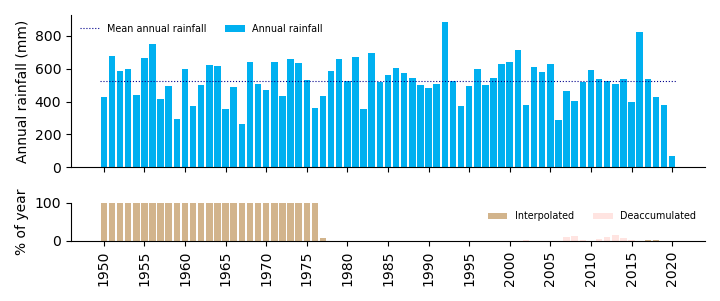

# ausweather

Very very very alpha - built for daily/monthly/annual rainfall initially.

Download weather data from BoM via SILO, for now.

E.g. for Kent Town annual rainfall. Find the station number using the BoM
[Weather Station Directory](http://www.bom.gov.au/climate/data/stations/):

```python
>>> import ausweather
>>> data = ausweather.fetch_bom_station_from_silo(23090, 'kinverarity@hotmail.com')
station #: 23090 name: ADELAIDE (KENT TOWN) title: 23090 ADELAIDE (KENT TOWN) (fetched from SILO on 2020-03-04 16:23:26.395696)
>>> data.keys()
dict_keys(['silo_returned', 'station_no', 'station_name', 'title', 'df', 'annual', 'srn'])

>>> data['df'].info()
RangeIndex: 25630 entries, 1 to 25630
Data columns (total 28 columns):
Date       25630 non-null datetime64[ns]
Day        25630 non-null int32
Date2      25630 non-null object
T.Max      25630 non-null float64
Smx        25630 non-null int32
T.Min      25630 non-null float64
Smn        25630 non-null int32
Rain       25630 non-null float64
Srn        25630 non-null int32
Evap       25630 non-null float64
Sev        25630 non-null object
Radn       25630 non-null float64
Ssl        25630 non-null int32
VP         25630 non-null float64
Svp        25630 non-null int32
RHmaxT     25630 non-null float64
RHminT     25630 non-null float64
FAO56      25630 non-null float64
Mlake      25630 non-null float64
Mpot       25630 non-null float64
Mact       25630 non-null float64
Mwet       25630 non-null float64
Span       25630 non-null float64
Ssp        25630 non-null int32
EvSp       25630 non-null float64
Ses        25630 non-null int32
MSLPres    25630 non-null float64
Sp         25630 non-null int32
dtypes: datetime64[ns](1), float64(16), int32(9), object(2)
memory usage: 4.6+ MB
>>> data['annual'].head()
Date
1950    426.9
1951    677.9
1952    584.9
1953    601.0
1954    439.6
Name: Rain, dtype: float64
>>> ausweather.plot_silo_station(data['annual'], data['annual'].mean(), data['srn'])
```



## List of changes

### Version 0.2.1 (3 Mar 2020)
- Fix bug for whitespace in BoM station name

### Version 0.2.0 (3 Mar 2020)
- Update, many changes.

### Version 0.1.0 (11 Feb 2020)
- Initial release